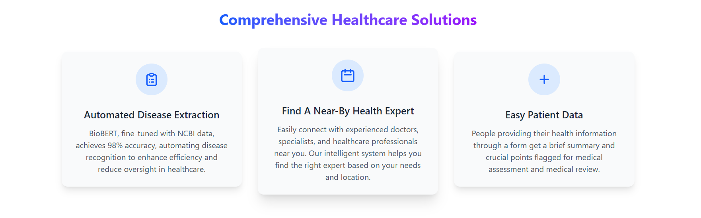

## Features

- **Disease Extraction**: Upload medical PDFs to automatically identify and highlight diseases using BioBERT
- **Nearby Doctor Finder**: Find healthcare specialists near you based on symptoms or location
- **Patient Data Form**: Generate AI-powered summaries from patient health information

## Tech Stack

- **Frontend**: React, React Router, Tailwind CSS, Framer Motion
- **Backend**: Flask, Flask-CORS, Transformers, PyPDF2, TextBlob
- **AI Models**: Hugging Face transformers, Ollama LLM

## Setup and Installation

### Backend Setup

1. Navigate to the backend directory:
   ```
   cd backend
   ```

2. Create a virtual environment:
   ```
   python -m venv myenv
   ```

3. Activate the virtual environment:
   - Windows: `myenv\Scripts\activate`
   - macOS/Linux: `source myenv/bin/activate`

4. Install dependencies:
   ```
   pip install -r requirements.txt
   ```

5. Start the Flask server:
   ```
   flask run --port=5002
   ```
   The backend will run on http://localhost:5002

### Frontend Setup

1. Navigate to the frontend directory:
   ```
   cd frontend
   ```

2. Install dependencies:
   ```
   npm install
   ```

3. Start the development server:
   ```
   npm run dev
   ```
   The frontend will run on http://localhost:5173

4. Open your browser and visit http://localhost:5173

## Requirements

- Python
- Node.js 
- Ollama (for local LLM support)

## Usage



1. Visit the homepage to explore available services ( Login and SignUp services won't be working )
2. Upload medical documents for disease extraction ( pdf with text only )
3. Enter symptoms to find nearby specialists
4. Fill out the patient form to receive an AI-generated summary